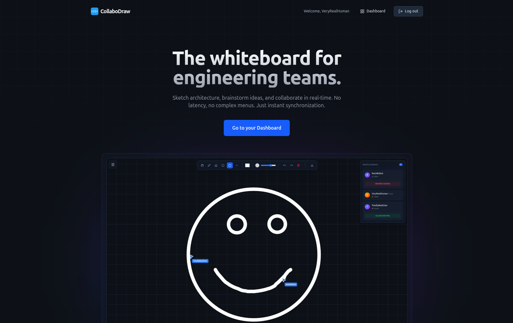
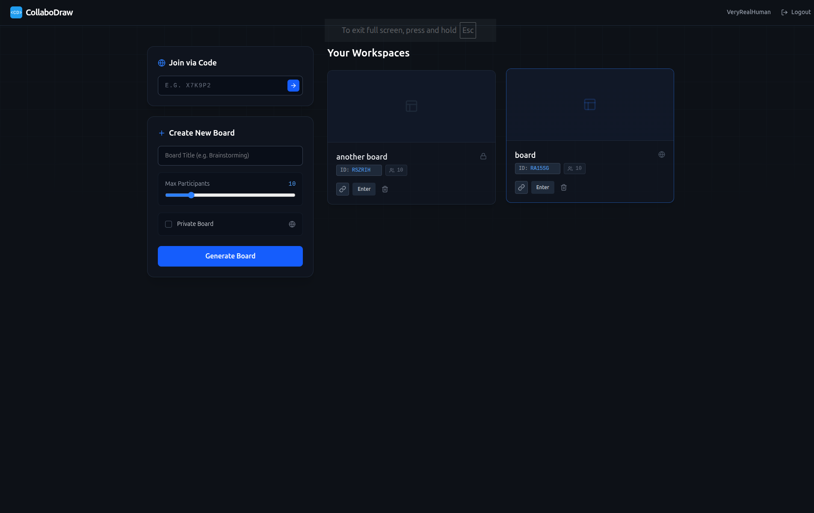
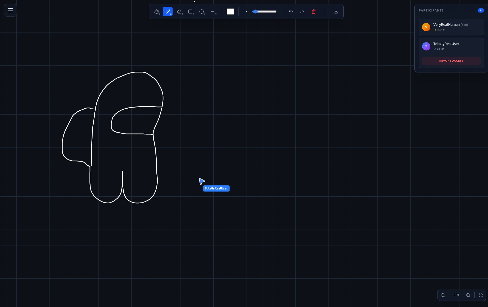

<div align="center">

# CollaboDraw

### A modern real-time collaborative whiteboard built with the MERN stack

Sketch ideas, brainstorm with your team, and collaborate seamlessly through low-latency real-time synchronization.

[]()
[]()
[]()
[]()
[]()
[]()

### Live Demo

**[Visit Website](https://collabodraw-frontend.vercel.app/)**

</div>

---

# Preview

## Landing Page



---

## Dashboard



---

## Collaborative Whiteboard



---

# Why CollaboDraw?

CollaboDraw is a real-time collaborative whiteboard designed for brainstorming, software design, teaching, and remote teamwork.

Unlike traditional CRUD applications, CollaboDraw focuses on solving the engineering challenges behind real-time collaboration—maintaining synchronized canvas state, handling concurrent users, managing live cursor presence, and delivering a smooth collaborative experience across multiple devices.

---

# Features

## Real-Time Collaboration

Collaborate seamlessly with multiple users on the same board. Every drawing action is synchronized instantly across all connected participants using WebSockets.

---

## Powerful Drawing Tools

Draw freely using:

- Freehand Pen
- Straight Lines
- Rectangles
- Circles
- Eraser

Customize every stroke with adjustable colors and stroke widths.

---

## Live Presence

See who is currently connected to your board.

- Live collaborator list
- Cursor presence
- Active participant count
- Presence notifications

---

## Role-Based Collaboration

Every board supports three permission levels:

- Owner
- Editor
- Viewer

Owners can approve join requests and control who can modify the board in real time.

---

## Persistent Boards

Boards are automatically saved.

Leave anytime and continue exactly where you left off.

---

## Infinite Canvas

Navigate naturally using smooth pan and zoom controls.

Perfect for large diagrams and brainstorming sessions.

---

## ↩ Undo / Redo

Made a mistake?

Undo and redo recent drawing actions using:

- Toolbar controls
- Keyboard shortcuts

---

## Export

Export your whiteboard as a PNG, JPG, and PDF with a single click.

---

## Responsive Design

Built for:

- Desktop
- Tablet
- Mobile

Pointer Events ensure consistent interaction across devices.

---

# Tech Stack

| Layer                   | Technology              |
| ----------------------- | ----------------------- |
| Frontend                | React, TypeScript, Vite |
| Styling                 | Tailwind CSS            |
| State Management        | Zustand                 |
| Backend                 | Node.js, Express        |
| Database                | MongoDB                 |
| Real-Time Communication | Socket.IO               |
| Authentication          | JWT                     |
| Deployment              | Vercel + Render         |

---

# Architecture

```
                 React + Zustand
                        │
          REST API + Socket.IO
                        │
                 Express Backend
                        │
                   MongoDB Atlas
```

---

# Project Structure

```
collabodraw/
│
├── client/
│   ├── components/
│   ├── hooks/
│   ├── pages/
│   ├── store/
│   └── utils/
│
├── server/
│   ├── controllers/
│   ├── middleware/
│   ├── models/
│   ├── routes/
│   ├── sockets/
│   └── utils/
│
└── README.md
```

---

# Engineering Highlights

During development, several architectural and engineering challenges were addressed.

### Real-Time Synchronization

- Low-latency Socket.IO communication
- Room-based collaboration
- Live cursor synchronization
- Multi-user drawing

---

### Performance Optimizations

- Cursor throttling
- Debounced canvas resizing
- Efficient canvas rendering
- Reduced unnecessary network traffic

---

### Authentication & Security

- JWT authentication
- Protected API routes
- Socket authentication
- Role-based access control

---

### User Experience

- Responsive layout
- Infinite canvas
- Keyboard shortcuts
- Presence notifications
- Loading & error states

---

# Getting Started

## Clone the repository

```bash
git clone https://github.com/aryansinha1908/collabodraw.git
```

---

## Install dependencies

### Frontend

```bash
cd client
npm install
```

### Backend

```bash
cd server
npm install
```

---

## Environment Variables

### Client

```env
VITE_SERVER_URL=
```

### Server

```env
PORT=
MONGO_URI=
JWT_SECRET=
CLIENT_URL=
```

---

## Start development

Backend

```bash
npm run dev
```

Frontend

```bash
npm run dev
```

---

# Roadmap

Planned improvements after the hackathon:

- [ ] Shape selection & manipulation
- [ ] Text tool
- [ ] Image uploads
- [ ] Board snapshots / version history
- [ ] Sticky notes
- [ ] Multiple board pages
- [ ] Laser pointer

---

<div align="center">

### Built for HackSphere 2026 ❤️

**Designed & Developed by Aryan Sinha**

</div>
